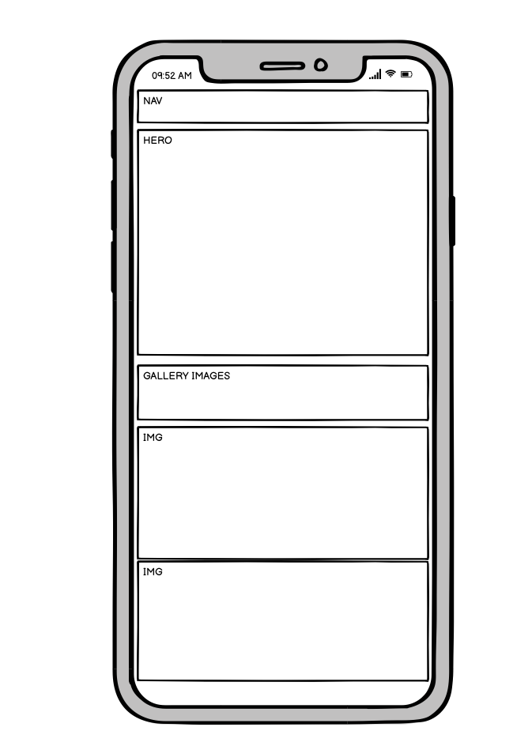

Below is the README.md file for Petal Bakehouse.

# Overview

Petal Bakehouse is a local bakery business. Within the project I am demonstrating my understanding of HTML5 and CSS3. I used the framework Bootstrap to help structure the site. Roughly 70% of the site is Bootstrap. I also used CSS Grid within the project with Media Queries to further show my understanding of Front-end web development. The site allows users to interact and control eliments with a bootstrap carousel. This was to enhance the sites interactiveness and appeal. The site is designed to showcase a local small business bakery.

---

## UX

In effort to keep the site visually appealing and easy to use i decided on a simple 3 color, 3 page layout which would prevent any confusion and remove any friction. The goal of the site is to showcase the bakerys talent and drive orders in, so images are a key pillar in the site and so is usability. Contrasting colors and clear spacing helps the visual appeal and keeps the sites goals clear.

1) First time

- As a first time user, I want to understand what the site is for
- As a first time user, I want to be able to easily navigate the site
- As a first time user, i would like to see visuals of what is on offer from the site

2) Returning

- As a returning user, I would like to be able to get to the order section in 3 clicks
- As a returning user, i would like to see your contact information

3) Frequent user

- As a frequent user, I would like to see your social media links.
- As a frequent user, i would like to see a display of new images in one place

---

## Design

### Color scheme.

### Typography

Lato is the font of choice with Helvetica and Sans-serif as fall back fonts should Lato not be imported into the site properly. Lato is a clear and legible font and according to google, one of the most popular choices in 2021. It also renders well on all viewport sizes.

I chose rem as my sizing metric. I feel this is the best fit in 2021 due to its flexabilty at different base sizes. I have also used percentages, VH or PX where i felt appropriate.

### Imagery

All imagery is imported into Gitpod and was downloaded from Pexels.com. The chosen images were designed to fit the site's niche and catch users attention. See below for individual file URLs...

- https://images.pexels.com/photos/1359330/pexels-photo-1359330.jpeg?cs=srgb&dl=pexels-cats-coming-1359330.jpg&fm=jpg
- https://www.pexels.com/photo/homemade-fresh-baked-bread-on-table-4495761/
- https://images.pexels.com/photos/2067436/pexels-photo-2067436.jpeg?cs=srgb&dl=pexels-marta-dzedyshko-2067436.jpg&fm=jpg
- https://images.pexels.com/photos/1028714/pexels-photo-1028714.jpeg?cs=srgb&dl=pexels-acharaporn-kamornboonyarush-1028714.jpg&fm=jpg
- https://www.pexels.com/photo/cheesecake-1126359/
- https://www.pexels.com/photo/brown-and-white-cake-on-white-ceramic-plate-3185509/
- https://images.pexels.com/photos/227432/pexels-photo-227432.jpeg?cs=srgb&dl=pexels-antonio-quagliata-227432.jpg&fm=jpg
- https://images.pexels.com/photos/1055272/pexels-photo-1055272.jpeg?cs=srgb&dl=pexels-vojtech-okenka-1055272.jpg&fm=jpg
- https://images.pexels.com/photos/6087672/pexels-photo-6087672.jpeg?cs=srgb&dl=pexels-koolshooters-6087672.jpg&fm=jpg
- https://images.pexels.com/photos/1346345/pexels-photo-1346345.jpeg?cs=srgb&dl=pexels-alisha-mishra-1346345.jpg&fm=jpg
- https://images.pexels.com/photos/3992206/pexels-photo-3992206.jpeg?cs=srgb&dl=pexels-cottonbro-3992206.jpg&fm=jpg
- https://www.pexels.com/photo/bakery-baking-bread-chocolate-267308/
- https://images.pexels.com/photos/3768146/pexels-photo-3768146.jpeg?cs=srgb&dl=pexels-andrea-piacquadio-3768146.jpg&fm=jpg
- https://images.pexels.com/photos/3656119/pexels-photo-3656119.jpeg?cs=srgb&dl=pexels-tijana-drndarski-3656119.jpg&fm=jpg
- https://images.pexels.com/photos/1756061/pexels-photo-1756061.jpeg?cs=srgb&dl=pexels-mariana-kurnyk-1756061.jpg&fm=jpg

---

## Wireframes/Site preview

The site was build mobile first.

I also done rough designs of the site at large viewport size (desktop)

Homepage

 
 

Gallery

Form

The homepage and gallery at tablet size. Form renders the same at all viewport sizes.

---

## Technology

### Languages

- HTML5
- CSS3
- Javascript (bootstrap)

### Frameworks/Features

- Bootstrap v4.6
- CSS Gris
- Google Fonts
- GIT
- GitPod
- Balsamiq
- Hover:css
- Transition:css
- Responsiveness
- Interactive elements (carousel)

# Testing

Testing was compiled throughout the project in effort to minimise bugs and styling issues.

The site works seamlessly across all viewport sizes but was built mobile first.

The image below does not represent the phone size at which the site was designed at. Just a representation that mobile first was the direction.

 

VS Code - at the half waypoint, and after some initial testing, I decided to make some structural changes to the site to improve the visual aesthetics and flow. In an effort to prevent any confusion, I migrated the code to VSC, made the structural changes there and then migrated it back in sections. This way I could test the changes and mitigate any styling issues that arose.

In effort to improve UX/UI i regularly tested the site functionality and responsiveness. This way I could see UX/UI issues first hand and deploy changes in accordance with our principles. I also drafted in my partner to attempt to break the site's viewing experience.

I tested the site on chrome, safari and firefox and across all sizes in dev tools.

 

  

I ensured my tests were in line with the key goals and objectives of the site.

Images referred to for all the below testing is available with the repository folder, testing imagery.

1) First time

As a first time user, I want to understand what the site is for

- Early within index.html users are exposed to ‘what we offer’ to add additional context.

 

- Hero image w/ text to add further context and excitement.

 

As a first time user, I want to be able to easily navigate the site

- Upon entry, users are greeted with a navigation bar.

 

- Call to action buttons available within the carousel and after ‘what we offer’.

 

As a first time user, i would like to see visuals of what is on offer from the site

- A carousel is present within index.html.

 

- A easily accessible gallery page.

 

2) Returning

As a returning user, I would like to be able to get to the order section in 3 clicks

- Click 1) order (scroll down to form) 2) submit.

As a returning user, i would like to see your contact information

- All contact information is within the footer and accessible from all pages.

 

3) Frequent user
As a frequent user, I would like to see your social media links.

- All social links in footer across all pages. Users have come to expect this with established sites.

As a frequent user, i would like to see a display of new images in one place

- A easily updatable carousel available on home page (index.html) and a gallery is one click away from nav and also the CTA button.

 

The W3C Markup Validator and W3C CSS Validator Services were used to validate every page of the project to ensure there were no syntax errors in the project.

### - HTML Results - pass

 

See folder for other html pass confimration images.

### - CSS Results - pass

In testing I noticed that fixed image backgrounds do not render on some mobile phones. In a live project I would remove this with a media query but after seeking advice, and hearing that your testing and review is done on desktop and dev tools only, I decided to note it here only. See below image.

Once the site was deployed i tested it in dev tools lighthouse. This showed that i had images of large sizes. I have compressed the images but they are still large which is affecting performance. In future and with customer facing sites i would compress the images more. Test below...

---

## Deployment

I deployed the site with GitHub pages. I have also researched Netlify for its front end deployment capability. I would use this should GitHub pages be unavailable.

The steps taken to deploy the site were as follows.

1) Update all image file locations to standard formatting. (See Git commit's for reference)
2) Save all files and commit final versions to GitHub repository
3) From GitHub repository, navigate to 'Settings'

4) Scroll down until you find the section 'GitHub Pages'

5) Under 'Source', change branch to 'Master' *this should populate the '/(root)' file. Keep this as is*
6) Hit 'Save'.
7) *Wait a few minutes for the changes to take affect* Now load the prompted URL.

## Credit

The transition css effect (style.css row 70) idea was taken from CSS Tricks - https://css-tricks.com/almanac/properties/t/transition/
I got high level guidance for the Gallery's CSS Grid from a youtube tutorial - https://www.youtube.com/watch?v=68O6eOGAGqA&t=16s although my grid layout is different.

**I am available for questions should you have any. Thank you.**